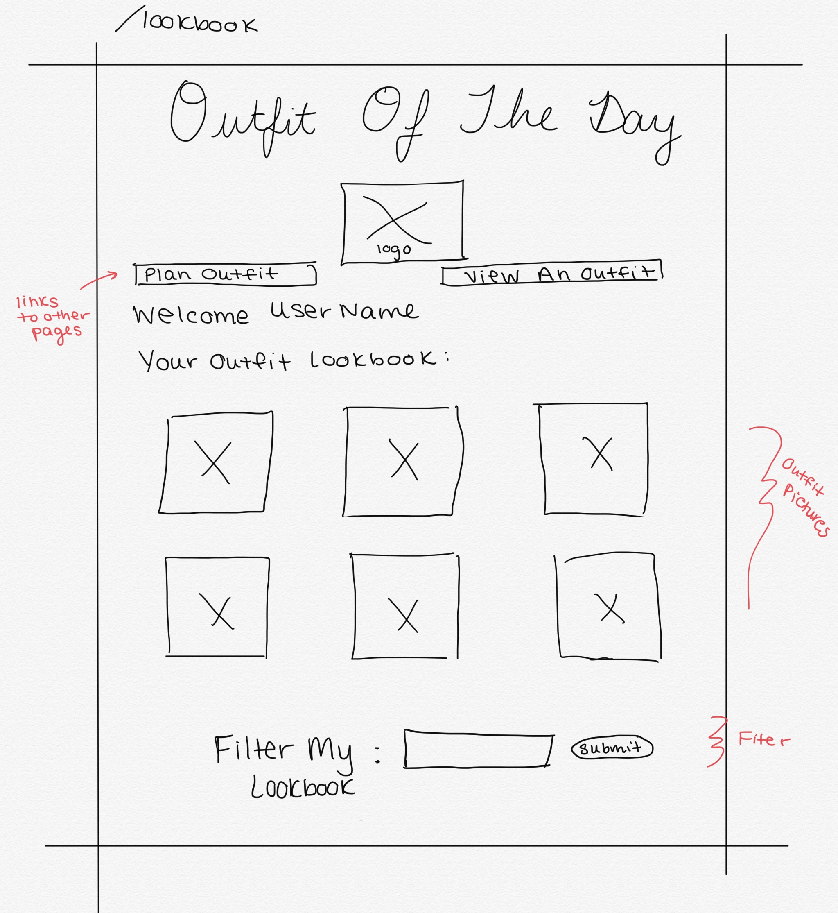
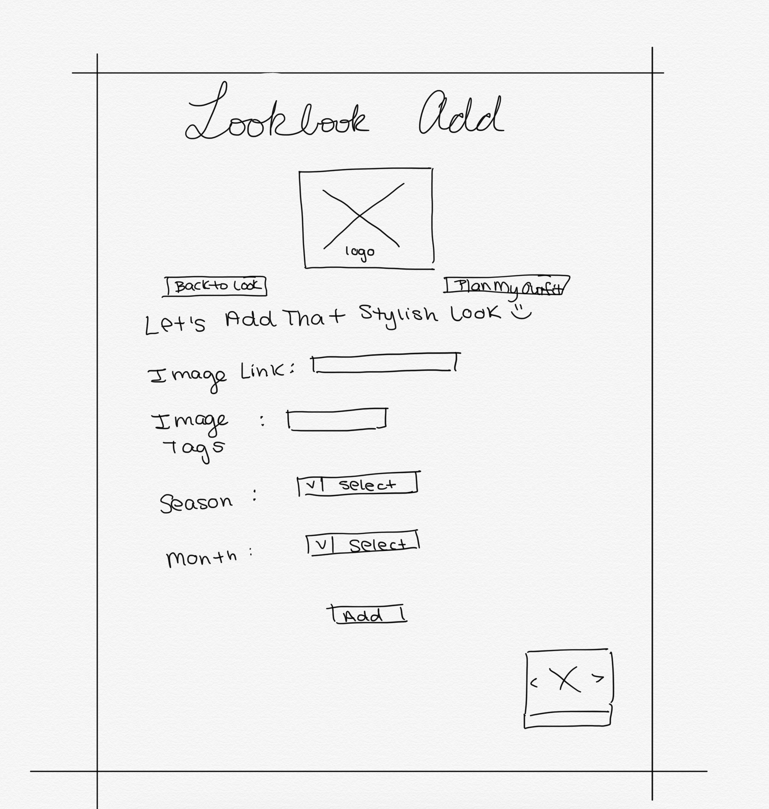
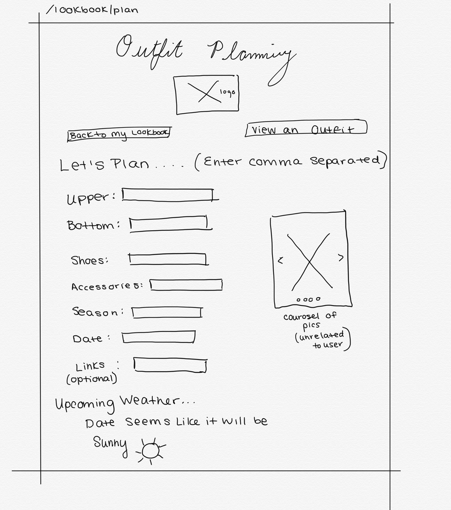
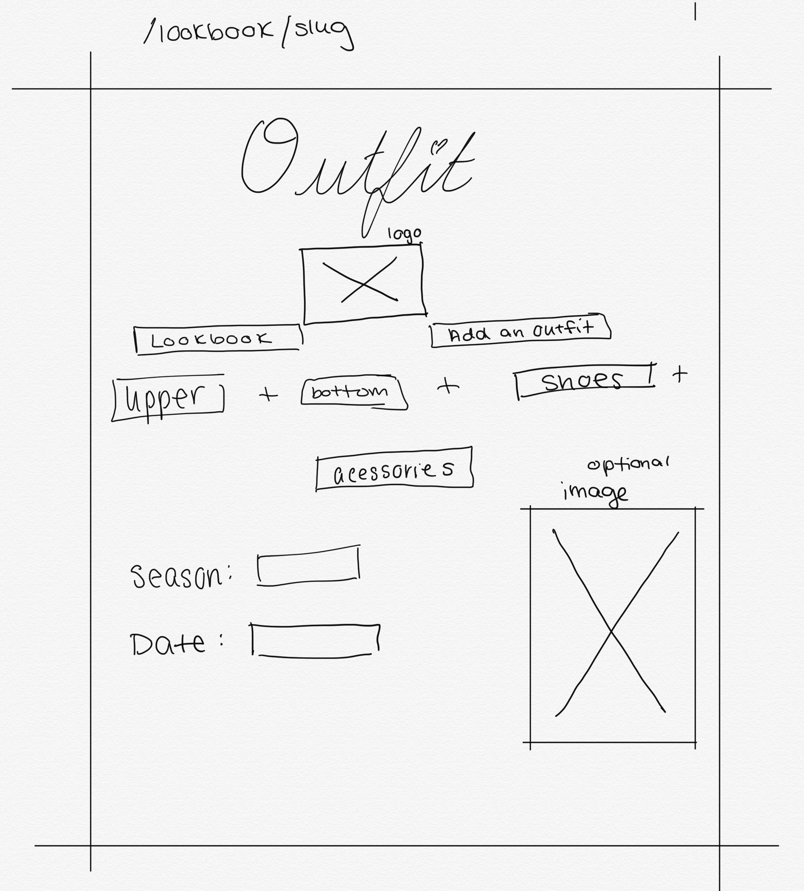
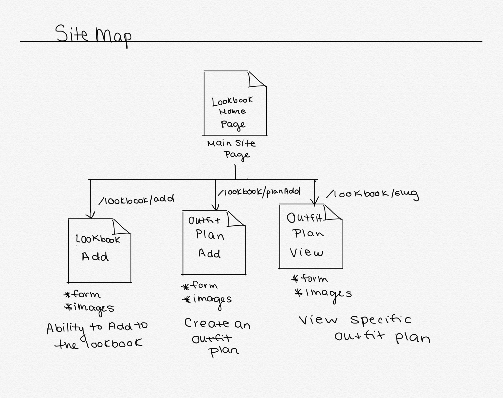

Outfit of The Day Central

# Outfit of The Day 

## Overview

If you are obsessed with fashion and planning your outfits.. this application will be perfect for you! Planning outfits can be stressful, but once you get that outfit of the day, you want to be able to save it and refer to it for future #OOTD ideas. Hence, I want to create Outfit of The Day. 

Outfit of the Day is a web application that allows users to keep track of outfits by sending image links and adding some relevant tags. The application then stores and sorts the uploaded outfit picture by season. The application also features an outfit planner, which will allow users to plan out outfits based on in app weather reports. Users can register and login. Once they're logged in, they can create or view universal lookbook and planners. For the lookbook, they can add pics to the list. For every outfit plan they can  plan new killer outfits according to occations and filter the killer outfits of others!

This application is something I would use, as I spend hours trying to come up with my outfit and seeking outfit advice. 


## Data Model

The application will store Users, Plans(outfit plans) and Looks(lookbook)

* users can have multiple outfit plans (via references)
* each user has a univeral lookbook (by embedding)
* each user can add to the universal lookbook or outfit plans (by embedding)

An Example User:

```javascript
{
  username: "sonamLovesClothes",
  hash: // a password hash,
  lists: // an array of references to outfit plan documents
}
```

An Example List with Embedded Items:

```plan
{
  user: // a reference to a User object,
  looks: [
    {upper: "long sleeve black tee", bottom:"denim bubble jeans", shoes: "black platform", acessories: "silver necklace", season: "spring", date: 2020-21-05, link: "https://i.pinimg.com/474x/50/86/b2/5086b20588b6ce5fea30855a2b24c77d.jpg"},
    {upper: "dress", bottom:"stockings", shoes: "black boots", acessories: "scarf", season: "winter", date: 2019-16-01, link: "https://www.instagram.com/p/B8o_Y11q6_D/"},
  ],
}
```


## [Link to Commented First Draft Schema](db.js) 

[database](db.js)

## Wireframes

/lookbook - page for seeing lookbook of all the outfits saved 



/lookbook/add - page for adding to lookbook



/lookbook/planAdd - page for adding outfit plans



/lookbook/slug - page for showing specific outfit plan




## Site map

My site map. Featuring 3 Sites connected to the main lookbook page.



## User Stories or Use Cases

1. as non-registered user, I can register a new account with the site
2. as a user, I can log in to the site
3. as a user, I can look at the lookbook
4. as a user, I can filter my lookbook based on specific seasons
5. as a user, I can view all of the outfit plans created
6. as a user, I can add outfit plans
7. as a user, I can filter specific outfit plans

## Research Topics

* (5 points) Integrate user authentication
    * I'm going to be using passport for user authentication
    * I want to use it for authentication of username and password
    * If the authentication fails I will tell the user what the problem is - weather it is an invalid username or invalid entry.
    I have not created an account yet but before implementing authentication in my program I will run with a test username and password. 
* (2 points) Bootstrap
    * I am going to use Bootstrap to use HTML and CSS templates to support a user friendly and more asthetically pleasing naviagtion and site look.
    * In particular, I want to learn how to add image carousels. 
    * Create unique buttons, forms, and tables. 
    * I also want to focus on implementing bootstraps responsive features that adjust to phones, tablets, and desktops
* (2 points) Getting data from a weather API 
    * I hope to get data from the weather company API to provide weather information to anyone using my application and planning an app. 
    * I want to parse and use information from the weather site.

9 points total out of 8 required points 


## [Link to Initial Main Project File](app.js) 


## Annotations / References Used

1. [passport.js authentication docs](http://passportjs.org/docs) - http://www.passportjs.org/docs/username-password/
2. [passport-local-mongoose](https://www.npmjs.com/package/passport-local-mongoose)
3. [passport-local-mongoose](https://medium.com/@kevinhsu_83500/user-authentication-with-node-js-and-mongodb-c8b1645513f9)
4. [node.js Authentication with Passport](https://blog.cloudboost.io/node-js-authentication-with-passport-4a125f264cd4)
5. [bookstrap](https://getbootstrap.com/docs/4.4/getting-started/introduction/) 
    - started reading - https://getbootstrap.com/docs/4.0/components/carousel/
6. [weather](https://weather.com/swagger-docs/call-for-code)

